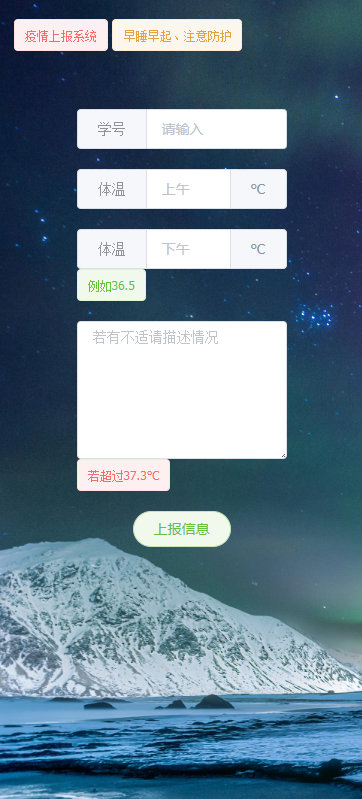

# 项目名称: 疫情上报系统
## 需求分析: 
                        毕业季很忙每天都要向上报班级的体温信息、收集起来非常繁琐.于是诞生了此想法
   1.解决班级每天温度上报
   2.后台一键每日导出Excel表然后上报学院
## 技术选型
   Element-UI+SpringBoot+mysql 
   界面部分:   
   用户/后台  
      
   其他信息班级、姓名、性别、地址、手机这些提前录在数据库里,减少用户输入内容.  
   这样每天就可以轻松导出当日统计情况:)  
##健康码采集助手V2
  新增 健康码收集功能 
  新增 健康码后台管理功能
